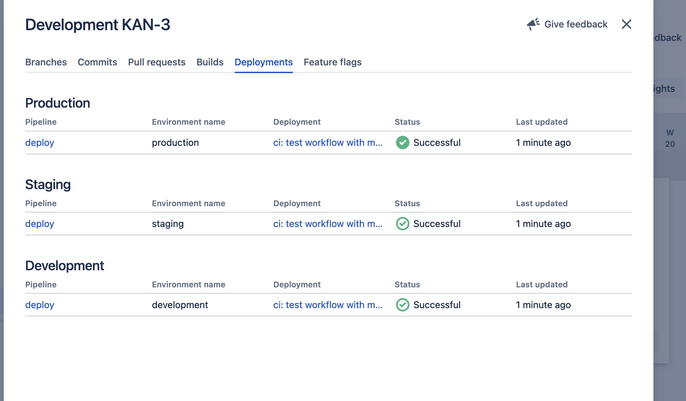
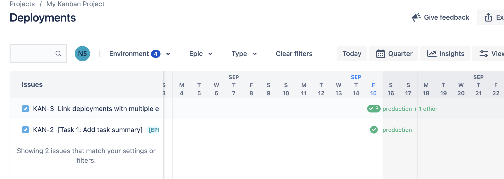
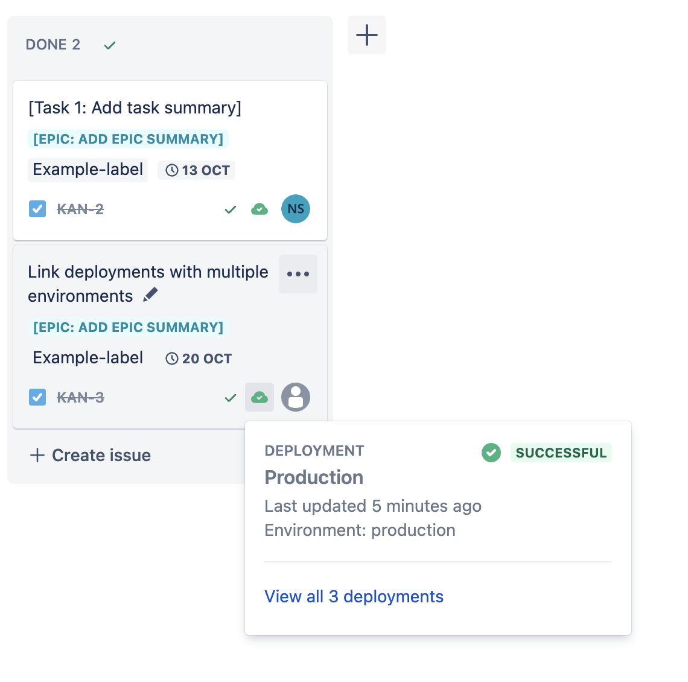

# GitHub Integration with Jira and Displaying Deployments

This guide will walk you through the process of integrating GitHub with Jira and displaying GitHub deployments within Jira. By following these steps, you'll be able to streamline your development and project management workflows.

****
## TL;DR Summary

1. Install the GitHub for Jira app by [following the Atlassian guide](https://support.atlassian.com/jira-cloud-administration/docs/integrate-with-github/).
2. Authorize GitHub integration within Jira to establish the connection.
3. Configure GitHub Actions workflows to **create deployments** [(3.1)](#31-create-deployments) and **update deployment statuses** [(3.2)](#32-update-deployment-status). These steps are crucial for successful integration and visibility of deployments within Jira.
4. [See workflow](https://github.com/ap0h/jira-integration-test/blob/c749167531ebaf8bf301b87bee9f9784c5db51dd/.github/workflows/deploy.yml) from this repo for steps **3.1** and **3.2**

With these steps completed, you'll have a seamless integration between GitHub and Jira, and you'll be able to monitor deployment statuses directly within your Jira projects. 

Happy coding and project management! 🚀
****

## Detailed Instructions

### 1. Install GitHub for Jira App

**Follow the Atlassian Guide**

Start by [installing the GitHub for Jira app](https://support.atlassian.com/jira-cloud-administration/docs/integrate-with-github/). This app is essential for connecting GitHub with your Jira instance.

### 2. Authorize GitHub Integration

If you finished step 1 this is already done.
After installing the GitHub for Jira app, connect and authorize GitHub within Jira. This step establishes the connection between your GitHub repositories and your Jira projects.

### 3. Create Deployment Workflows

In order to make deployments visible in Jira, you need to set up deployment workflows. This involves two key actions:

#### 3.1. Create Deployments

Use the GitHub Actions workflow to create deployments. These deployments represent different stages of your software development process, such as development, staging, and production.

- You can use the [chrnorm/deployment-action](https://github.com/chrnorm/deployment-action) GitHub Action to create deployments.

#### 3.2. Update Deployment Status

After deploying your application, it's crucial to update deployment statuses in Jira based on success or failure.

- Utilize the [chrnorm/deployment-status](https://github.com/chrnorm/deployment-status) GitHub Action to update deployment statuses. This ensures that Jira accurately reflects the status of your deployments.

  
<h2>Results<h2>

  Deployments within Jira ticket

  

  Deployments tab

  

  Ticket status indicator

  

## Resources

For more in-depth information, refer to the following resources:

- [Integrate Github With Jira Manual](https://support.atlassian.com/jira-cloud-administration/docs/integrate-with-github/)
- [How to Use the Github for Jira app](https://support.atlassian.com/jira-cloud-administration/docs/use-the-github-for-jira-app)
- [Showing GitHub deployments in Jira](https://github.com/atlassian/github-for-jira/blob/main/docs/deployments.md)
- [Github action to create deployments as part of actions](https://github.com/chrnorm/deployment-action)
- [Github action to update the status of deployments](https://github.com/chrnorm/deployment-status)

